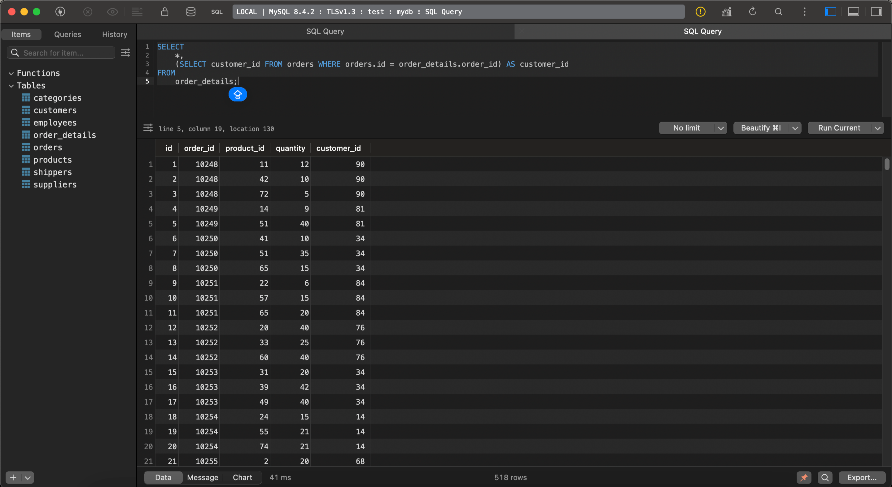
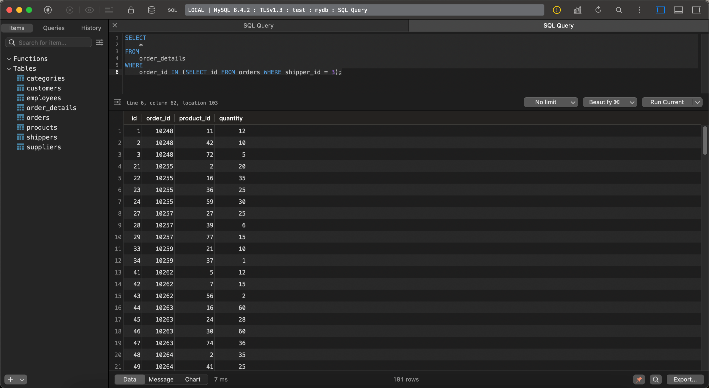
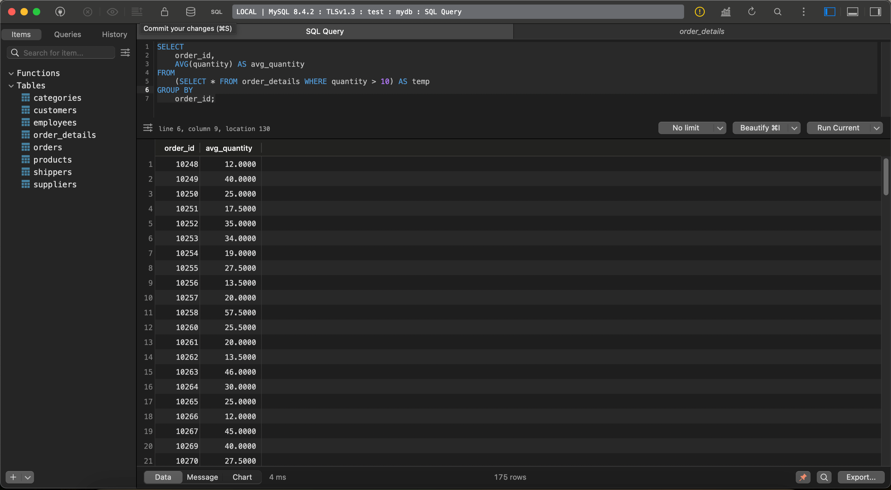
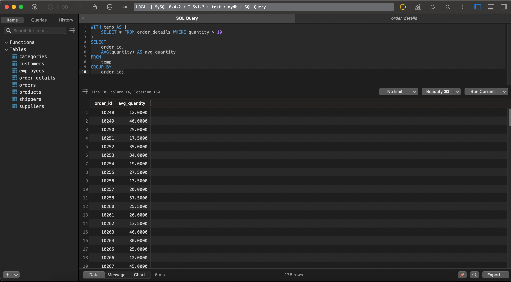
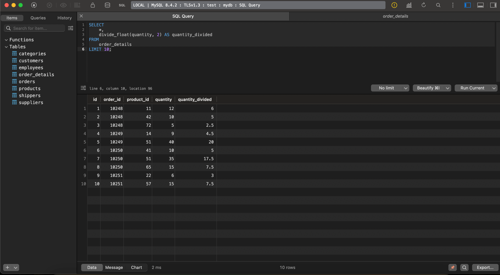

# goit-rdb-hw-05

## Завдання 1

Напишіть SQL запит, який буде відображати таблицю *order_details* та поле *customer_id* з таблиці *orders* відповідно для кожного поля запису з таблиці *order_details*.

Це має бути зроблено за допомогою вкладеного запиту в операторі `SELECT`.

### Відповідь 1

```sql
SELECT
    *,
    (SELECT customer_id FROM orders WHERE orders.id = order_details.order_id) AS customer_id
FROM
    order_details;
```



## Завдання 2

Напишіть SQL запит, який буде відображати таблицю *order_details*. Відфільтруйте результати так, щоб відповідний запис із таблиці orders виконував умову `shipper_id=3`.

Це має бути зроблено за допомогою вкладеного запиту в операторі `WHERE`.

### Відповідь 2

```sql
SELECT
    *
FROM
    order_details
WHERE
    order_id IN (SELECT id FROM orders WHERE shipper_id = 3);
```



## Завдання 3

Напишіть SQL запит, вкладений в операторі FROM, який буде обирати рядки з умовою `quantity>10` з таблиці *order_details*. Для отриманих даних знайдіть середнє значення поля *quantity* — групувати слід за *order_id*.

### Відповідь 3

```sql
SELECT
    order_id,
    AVG(quantity) AS avg_quantity
FROM
    (SELECT * FROM order_details WHERE quantity > 10) AS temp
GROUP BY
    order_id;
```



## Завдання 4

Розв’яжіть завдання 3, використовуючи оператор `WITH` для створення тимчасової таблиці *temp*. Якщо ваша версія MySQL більш рання, ніж 8.0, створіть цей запит за аналогією до того, як це зроблено в конспекті.

### Відповідь 4

```sql
WITH temp AS (
    SELECT * FROM order_details WHERE quantity > 10
)
SELECT
    order_id,
    AVG(quantity) AS avg_quantity
FROM
    temp
GROUP BY
    order_id;
```



## Завдання 5

Створіть функцію з двома параметрами, яка буде ділити перший параметр на другий. Обидва параметри та значення, що повертається, повинні мати тип `FLOAT`.

Використайте конструкцію `DROP FUNCTION IF EXISTS`. Застосуйте функцію до атрибута *quantity* таблиці *order_details*. Другим параметром може бути довільне число на ваш розсуд.

### Відповідь 5

```sql
DROP FUNCTION IF EXISTS divide_float;

DELIMITER //

CREATE FUNCTION divide_float(a FLOAT, b FLOAT)
RETURNS FLOAT
DETERMINISTIC
NO SQL
BEGIN
    RETURN a / b;
END //

DELIMITER ;

SELECT
    *,
    divide_float(quantity, 2) AS quantity_divided
FROM
    order_details
LIMIT 10;
```


